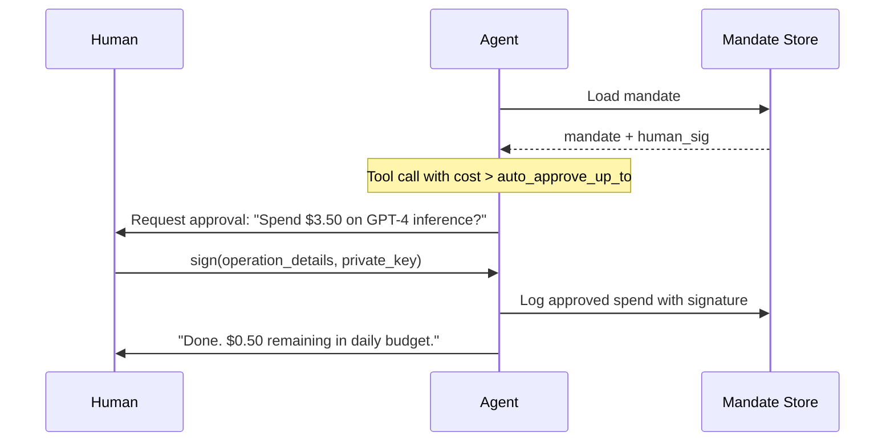

# Agent Payments Protocol (AP2) — Payment Mandate

**Status:** Published
**Version:** 1.0.0
**Layer:** L7 (Agent OSI Model — Governance)
**License:** CC BY 4.0
**Supersedes:** Agent Economics Protocol §3.2 (spending authority)

## 1. Purpose

Define a machine-readable **payment mandate** — a pre-authorized spending agreement between a human principal and an agent (or agent fleet). The mandate sets hard boundaries on token-based spending: per-transaction caps, total budget, expiration, and required cryptographic human signatures for specific operations.

Unlike the Agent Economics Protocol (which covers agent-to-agent credit exchange), AP2 mandates govern **how agents spend real or tokenized value** on behalf of a human. This includes API credits, compute budget, SaaS subscriptions, and any resource with a cost.

### Problem
Agents need to spend money to be useful — API calls, compute, SaaS tools — but giving an agent unrestricted spending authority is reckless. Today, most agent systems either block all spending (limiting capability) or trust the agent completely (risking runaway costs). There's no standard for pre-authorized, machine-enforceable spending budgets.

### Solution
A machine-readable payment mandate signed by a human principal that sets hard boundaries: per-transaction caps, total budget, expiration date, and which operations require explicit human approval. The mandate is enforced at the agent runtime via a pre-tool-call hook — before any paid tool executes, the agent checks the mandate and either auto-approves (below threshold) or requests human signature.

### When to use
- Giving an agent a budget to spend on API calls, compute, or SaaS tools
- Pre-authorizing spending without approving every individual transaction
- Setting per-provider or per-action spending caps (e.g., max $2 per OpenAI call)
- Audit-trail requirements for all agent spending

### When NOT to use
- Agent only uses free tools and APIs — no spending authority needed
- Human approves every individual spend manually — mandate is unnecessary overhead
- You need agent-to-agent payments (not human-to-agent) — use Agent Economics instead
- You need action-level guarantees for individual payment execution — use Transaction Protocol

### How it compares to similar specs
| Instead of THIS | When | Because |
|---|---|---|
| Agent Economics | Agents paying each other for subcontracted work | Economics handles agent-to-agent credit exchange; AP2 handles human-to-agent spending authority |
| Transaction Protocol | Guaranteeing a specific payment action executed exactly once | Transaction Protocol provides idempotency and rollback for individual actions; AP2 sets the budget boundaries those actions must stay within |
| AI Gateway | Enforcing policy at the fleet level for all agent requests | Gateway is a centralized enforcement point for fleet-wide policies; AP2 is a per-agent spending mandate embedded in the agent's runtime |

### What you lose without THIS
- Agents can't spend money autonomously on paid tools — every cost requires manual human approval
- No hard budget enforcement — agents can silently exceed spending limits
- No standardized audit trail for agent spending across tools and providers
- Runaway costs from agent loops become a real risk

## 2. Design Principles

- **Human-in-the-loop by default** — every mandate requires an authorizing signature from the human principal. Certain operations can waive this via `auto_approve_up_to`.
- **Spend boundaries enforced at the agent runtime** — the mandate is embedded in the agent's system prompt and checked by a pre_tool_call hook before any paid tool invocation.
- **Expiration mandatory** — no mandate is valid indefinitely. Hard TTL is required.
- **Audit trail** — every spend event is logged. Periodically reconciled with the human.
- **No blockchain** — mandates are signed JSON documents. Verification uses Ed25519 or EdDSA.

## 3. Schema

```yaml
ap2_mandate:
  mandate_id: "mnd_a1b2c3d4e5"
  version: "0.9"
  issued_at: "2026-06-19T12:00:00Z"
  expires_at: "2026-07-19T12:00:00Z"
  
  principal:
    name: "Human Name"
    identity: "did:key:z6Mk..."     # human's Ed25519 public key
    contact: "mailto:hello@example.com"

  authorized_agents:
    - agent_id: "delegator-01"
      fleet: "fleet-alpha"
    - agent_id: "researcher-02"
      fleet: "fleet-alpha"

  spend_limits:
    currency: "USD"                  # or "compute_credits", "tokens", "API_calls"
    total_budget: 50.00              # hard ceiling for mandate lifetime
    per_transaction_max: 5.00        # single API call / purchase cap
    daily_budget: 15.00             # optional — resets daily at 00:00 UTC
    auto_approve_up_to: 1.00        # transactions ≤ this skip human approval
    
  restricted_operations:
    - action: "model_inference"
      provider: "openai"
      max_per_call: 2.00
    - action: "code_execution"
      provider: "sandbox"
      max_per_call: 0.50
    - action: "saas_subscription"
      allow: false                   # never auto-authorize recurring spend

  approvals:
    - action: "exceeds_budget"
      required: "human_signature"
    - action: "new_provider"
      required: "human_signature"
    - action: "saas_subscription"
      required: "human_signature"

  # Human's cryptographic authorization
  human_signature: {
    "algorithm": "Ed25519",
    "signed_fields": [
      "mandate_id", "total_budget", "per_transaction_max",
      "expires_at", "authorized_agents[*].agent_id"
    ],
    "signature": "hex-encoded-ed25519-signature-of-mandate-hash",
    "signing_key_fingerprint": "z6Mk..."
  }
```

## 4. Field Reference

| Field | Required | Description |
|-------|----------|-------------|
| `mandate_id` | yes | Unique identifier. Prefix `mnd_` recommended. |
| `version` | yes | Schema version. Current: `0.9`. |
| `issued_at` | yes | ISO 8601 timestamp of mandate creation. |
| `expires_at` | yes | Hard expiry. Agents MUST reject operations after this. |
| `principal.identity` | yes | DID or public key fingerprint. |
| `authorized_agents` | yes | List of agent IDs covered by this mandate. |
| `spend_limits.total_budget` | yes | Hard ceiling. |
| `spend_limits.per_transaction_max` | yes | Per-operation cap. |
| `spend_limits.auto_approve_up_to` | no | Threshold for auto-approval. Default: 0 (all require human). |
| `human_signature` | yes | Cryptographic proof of human authorization. |
| `restricted_operations` | no | Per-provider or per-action overrides. |

## 5. Enforcement (Agent Runtime)

The enforcement middleware SHOULD:

1. Extract the mandate from an `AP2_MANDATE` environment variable or config path at session start.
2. Register a pre_tool_call hook that intercepts any tool with `cost > 0`.
3. For each paid tool call:
   a. Check `expires_at` — reject if expired.
   b. Check `spend_limits.total_budget` — reject if exceeded.
   c. Check `spend_limits.per_transaction_max` — reject if over.
   d. Check `spend_limits.auto_approve_up_to` — if cost ≤ threshold, approve silently.
   e. If cost > threshold, emit `human_approval_required` event with mandate + tool details.
4. Log every approved and rejected spend to an audit trail (`spend_log`).

→ See [implementation examples](ap2-mandate/v1.0.0/) for the complete enforcement middleware implementation and pseudocode.

## 6. Human-in-the-Loop Signature Flow



The human can pre-sign batches for recurring operations (e.g., "approve all inference under $1 for the next 24h").

## 7. Audit Trail

```yaml
spend_log:
  mandate_id: "mnd_a1b2c3d4e5"
  entries:
    - timestamp: "2026-06-19T12:05:00Z"
      agent_id: "delegator-01"
      tool: "openai_inference"
      cost: 0.85
      approved: true
      approval_method: "auto_approve"
    - timestamp: "2026-06-19T12:30:00Z"
      agent_id: "researcher-02"
      tool: "saas_subscription"
      cost: 10.00
      approved: true
      approval_method: "human_signature"
      signature: "hex-..."

  totals:
    spent: 10.85
    remaining: 39.15
    daily_spent: 10.85
```

## 8. Roadmap

- [x] Mandate schema v0.9
- [x] Human signature flow
- [x] Enforcement pseudocode
- [ ] Hermes Agent pre_tool_call plugin implementation
- [ ] Hermes Agent config integration (`AP2_MANDATE` env var)
- [ ] Example mandate generator (CLI tool)
- [ ] Spend reconciliation (periodic summary to human)

---

---

## Version History

| Version | Date | Changes |
|---------|------|---------|
| 1.0.0 | 2026-06-20 | Moved inline implementation examples to versioned example directories. Spec definitions unchanged. |
| 0.9.0 | — | Initial specification. |

## Examples

Implementation examples for this version:

| Language | File |
|----------|------|
| Python | [ap2-mandate/v1.0.0/python.md](ap2-mandate/v1.0.0/python.md) |
| TypeScript | [ap2-mandate/v1.0.0/typescript.md](ap2-mandate/v1.0.0/typescript.md) |
| cURL | [ap2-mandate/v1.0.0/curl.md](ap2-mandate/v1.0.0/curl.md) |

